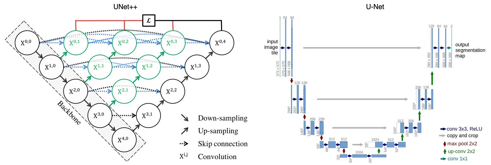
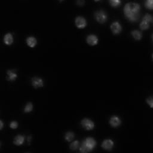
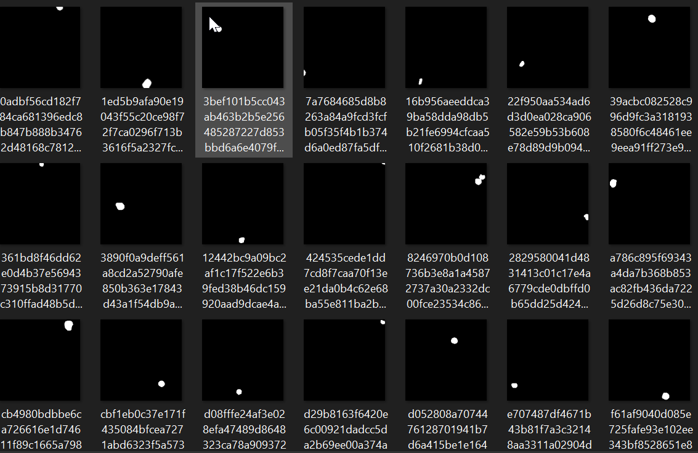
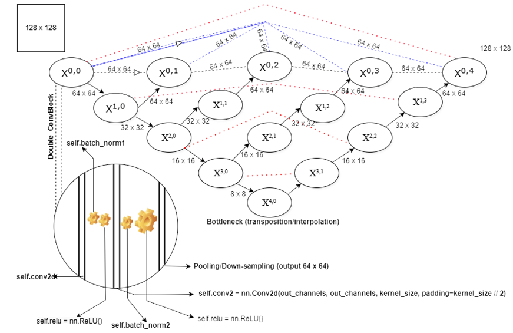

# ResNet-18 and U-Net++
<details>
  <summary>Click to view/unview U-Net++ Architecture</summary>
   
  
</details>

<details>
  <summary>Click to view/unview Original ResNet-18 Architecture</summary>
   
  
</details>

## Description:

🟢 In this pytorch project, I performed **transfer learning** on an **Ants and Bees dataset**  making use of **ResNet-18**. I also trained an image segmentation model using the **U-Net++** architecture. For the Resnet-18 Model, I used **torchvision.transforms**, I applied different **image augmentation techniques** and normalized the images using their **mean** and **standard deviation**. I defined a custom function, **def** `train_model()`, to streamline the model training process and to facilitate the usage of the **ResNet-18 architecture** for both **forward propagation** and **backpropagation**, as well as calculating and monitoring its  **loss function and accuracy**. The **classification accuracy** achieved with the **ResNet-18** model was **94%**.

🔵 As for U-net++, which is my focus in this repository, I encountered several Issues such as the kind of U-net++ Architecture I was using, the incompatibility of Libraries, the still-unknown reasons for it not running on my Laptop but on github codespaces😅, and Skip connections receiving different dimensions of inputs than they expected. Thankfully, I found [a repository on github](https://github.com/4uiiurz1/pytorch-nested-unet) that helped me to a great extent (though I still needed to do some debugging and recoding) to train the model.

## What is U-Net++ and how does it work?

### What is it?



U-Net++ (U-Net Plus Plus) is an extension of the original U-Net architecture, designed to improve segmentation tasks. It enhances U-Net by adding nested skip pathways and deep supervision. This architecture helps to better capture fine-grained features and improves the accuracy of segmentation, especially in complex images. The nested skip pathways allow better gradient flow and more precise information exchange between layers.

### How Does It work?

#### Images and Masks

For Image segmentation tasks, where we are basically teaching the model to recognize a particular object(the foreground) amidst other objects(the background)...

we need a dataset with images and their masks.

IMAGE EXAMPLE



MASK EXAMPLE



In the [Dataset I used](https://www.kaggle.com/c/data-science-bowl-2018/data) for the segmentation task, the images and their various masks needed to be organized in a particular folder structure for the model.

#### Encoder ➡️ Decoder

After we have our image and masks we write a ton of code to pass each image through the encoder, skip pathways, and the decoder of the Nested U-Net(U-Net++). 




In the Image above each circle can be seen as level. Each level consists of two 3x3 convolutional layers each followed by a Relu activation unit. The transition to the next layer is handled by a 2x2 max-pooling unit with a stride of 2 for downsampling. The image becomes half its size as it goes from level to level in the encoder but the number of channels double. This is similar to saying that the U-net++ architecure tries to "zoom into" each image to understand its pixel-wise details. This only makes the model understand the components/the "what" of the pixels). The decoder learns the "where" of the foreground. The final image size is predicted and compared with the original mask to calculate the loss, and a backward propagation is carried out to adjust the models weights through an ADAM or Stochastic Gradient Descent Optimizer.

## Now to the CODE!
Each of the .py or Python script files below were run in the terminal using the simple command

```bash
python name_of_script.py
```


- `preprocess_dsb2018.py`📁 - This script processes the image and mask data from the provided dataset, preparing them for training the model. It loads images and associated mask data, resizes them to a specified size, converts mask images to binary format where mask pixels are marked as 1 and the rest as 0, and saves the processed images and masks into organized directories, ready for model input. It changes the structure of the dataset from this:

```raw
inputs
└── data-science-bowl-2018
    ├── stage1_train
    |   ├── 00ae65...
    │   │   ├── images
    │   │   │   └── 00ae65...
    │   │   └── masks
    │   │       └── 00ae65...            
    │   ├── ...
    |
    ...
```

To This:

```raw
inputs
└── <dataset name>
    ├── images
    |   ├── 0a7e06.jpg
    │   ├── 0aab0a.jpg
    │   ├── 0b1761.jpg
    │   ├── ...
    |
    └── masks
        ├── 0
        |   ├── 0a7e06.png
        |   ├── 0aab0a.png
        |   ├── 0b1761.png
        |   ├── ...
        |
        └── 1
            ├── 0a7e06.png
            ├── 0aab0a.png
            ├── 0b1761.png
            ├── ...
```

- `dataset.py`📁- This script defined a custom dataset class for PyTorch to use which was intended to handle image and mask pairs for tasks like image segmentation. Here's a brief breakdown of what it does:

a. **Initialization (`__init__`)**:
   - The dataset is initialized with:
     - `img_ids`: A list of image identifiers.
     - `img_dir`: The directory containing the image files.
     - `mask_dir`: The directory containing the mask files.
     - `img_ext` and `mask_ext`: Extensions for image and mask files (e.g., `.jpg`, `.png`).
     - `num_classes`: The number of mask classes (e.g., background, object, etc.).
     - `transform`: Optional image and mask transformations (e.g., augmentation) to apply during data loading.
   - The `img_ids` are expected to correspond to both images and their associated masks.

b. **Length (`__len__`)**:
   - This method returns the number of images in the dataset by returning the length of `img_ids`.

c. **Item Retrieval (`__getitem__`)**:
   - This method retrieves an image and its corresponding mask given an index (`idx`).
   - It:
     - Loads the image using OpenCV (`cv2.imread`).
     - Loads masks for each class (the mask is read as grayscale and stacked together into a multi-channel array for all classes).
     - Optionally applies any transformations to the image and masks using the `transform` parameter (e.g., from `albumentations` library).
     - Normalizes the image and mask (divides by 255 for scaling between 0 and 1).
     - Reorders the dimensions of the image and mask (to channel-first format: `C x H x W`).
     - Returns the processed image, mask, and a dictionary containing the image ID.

- `metrics.py`📁 - This Python file defines two functions—`iou_score` and `dice_coef`—which are commonly used for evaluating the performance of models in tasks like semantic segmentation, where the goal is to predict a masks of each pixel that represent a particular class.

- `losses.py`📁 - This Python file defines two customized loss functions (`BCEDiceLoss` and `LovaszHingeLoss`) used in training deep learning models, particularly for tasks like image segmentation. The loss functions combine different components to improve model performance.
  a. `BCEDiceLoss` - Combines Binary Cross Entropy (BCE) and Dice Loss. BCE is used for binary classification problems; comparing the predicted logits (input) with the true labels (target) while the Dice Loss calculates the *Dice Coefficient*, which measures the overlap between the predicted and actual values penalizing small overlaps and promoting better predictions.
  b. `LovaszHingeLoss` - This loss uses Lovasz Hinge Loss, which is a loss function designed for the Lovasz-Softmax optimization method. It is often used in segmentation tasks with unbalanced classes. Imagine a segmentation task where you want to classify each pixel in an image as either "foreground" (the object of interest) or "background". If the object of interest only occupies a small part of the image, you might have many more background pixels than foreground pixels. In such cases, the background class is overrepresented compared to the foreground class. This is the common situation of real-world image datasets; they possess unbalanced classes.

- `utils.py`📁 - This contains three functions:

    a. str2bool converts strings to boolean values.
  
    b. count_params counts the trainable parameters in a model.
  
    c. AverageMeter is used to track and calculate running averages of values, such as loss or accuracy, during training.

- `train.py`📁 - This script trains and validates a deep learning model for image segmentation (In this case U-Net++), allowing configuration of model architecture, loss functions, optimizer, and data augmentation. It splits the dataset into training and validation sets, trains the model, tracks performance metrics (loss and IoU), and saves the best model based on validation performance. It also supports early stopping and learning rate scheduling.


-----------------------

Currently, I am learning about the **U-Net++ architecture**—an evolution from the **U-Net**—which introduces **dense skip pathways** between the encoder and decoder blocks. These dense skip connections significantly improve **feature propagation**, enhance **gradient flow**, and allow for the capture of more **fine-grained details** in the segmentation output. Unlike U-Net, **U-Net++** creates a series of **nested skip connections** at each level, bridging the encoder and decoder at multiple levels. This design ensures that the decoder receives rich features from multiple encoder layers, helping to improve **localization accuracy** and **contextual information** during the image segmentation process.
